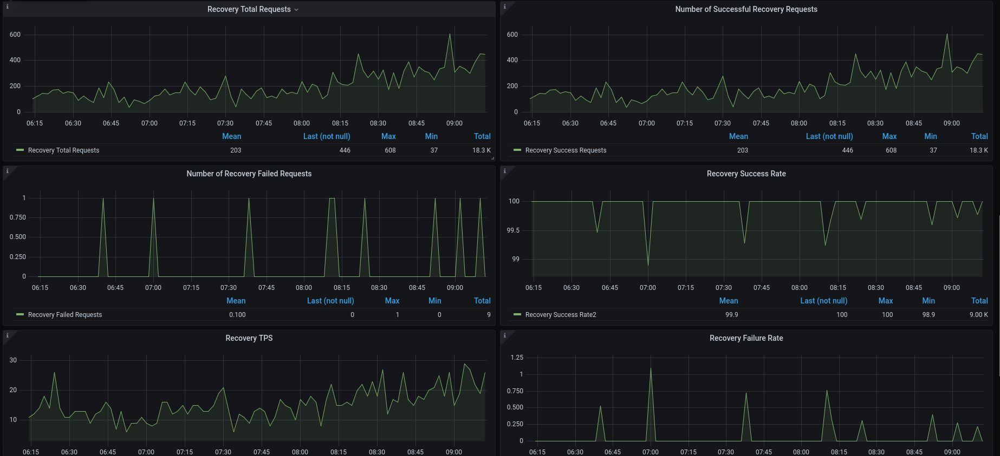
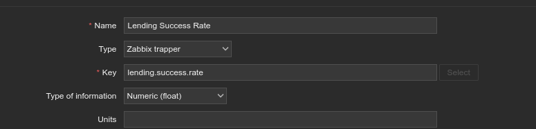

# Zabbix_Api_Monitoring
Monitor Specific API Call Success/Failure Rates and TPS from Nginx Logs Using Python, Zabbix, and Grafana


## Sample Dashboard



## 🚀 Features

- **Real-time log parsing** from Nginx access logs.
- Calculates **API success/failure rates** and **TPS (transactions per second)**.
- Sends custom metrics to **Zabbix** using Zabbix sender.
- Displays metrics with **Grafana dashboards** for easy visualization.
- Supports **off-peak time handling** to maintain accurate KPIs.
- Lightweight, easy to configure, and extendable.

  
## Background & Problem
Our system made high-frequency API calls to a third-party service via an Nginx reverse proxy. We were sending thousands of requests per second, but when the third-party service had issues, our calls would fail without warning.

Because we had no access to the third-party system, we relied on our Nginx access logs to monitor API call health. The challenge was to detect issues quickly and understand the impact.

here is sample of our revres proxy nginx config file 

<pre>log_format apilogs
    '$remote_addr $remote_user [$time_local] '
    '$request_method '
    '$request_uri '
    '$status $body_bytes_sent '
    '$request_time ($upstream_response_time) '
    'apicalls '
    '"$http_user_agent" "$http_x_forwarded_for" "$http_referer"';
server {
    listen PORT;
    keepalive_timeout 60;
    send_timeout 60;
    location / {
        proxy_pass  http://YOUR3rdPartyIP:Your3rdPartyPORT$request_uri;
        proxy_http_version 1.1;
        proxy_set_header Connection "";
        access_log  /var/log/nginx/apipostdata.log apilogs;
    }
}
  </pre>
## Why Can't We Use Zabbix log.count?

The problem with using Zabbix’s log.count function to calculate success/failure rates and TPS (Transactions Per Second) is related to timestamp accuracy.
Zabbix pollers operate on their own schedule to sample log files, independent of the actual timestamps in the logs. This can lead to inaccurate TPS values and misaligned success/failure counts.
For accurate monitoring, all metrics — success, failure, and TPS — must be measured based on the same timestamp window derived from the log entries themselves, not the poller's sampling interval.

## Soultion 
We use a Python script to process log data, extract key metrics (success/failure counts and TPS), and send them directly to Zabbix via trapper items. This ensures accurate, timestamp-aligned monitoring, independent of Zabbix’s polling schedule.

<p align="center">
  
</p>

Since some API calls occur during off-peak times when no requests may be made, this could negatively impact success rate calculations. To address this, the script reports a 100% success rate during off-peak periods to maintain consistent KPI monitoring, even when no API calls are made.


## ⚡ Quick Start
 
1. **Clone the repository:**
   ```bash
   git clone https://github.com/Amiri83/Zabbix_Api_Monitoring.git
   cd Zabbix_Api_Monitoring ```
   
### ⚙️ Configuration Python screipt 

To start monitoring, the user must call the `process_logs()` function in `parser.py` with the appropriate parameters:
### 🧩 Example:
```python
process_logs(
    service_name="sms",
    log_file="/var/log/nginx/apipostdata.log",
    success_pattern=r"SendSms 200",
    total_pattern=r"SendSms",
    offpeak_time='none'
)
```

- **ServiceName**  
  The name of the API being monitored.  

- **Success/Total Conditions**  
  Regular expressions are used to identify **successful** and **total** API calls within the logs.  
  The script analyzes logs from the **last 1 minute** by subtracting one minute from the current system time and applying the configured regex patterns to extract metrics.

  Refer to `sample_logs.txt` for an example of the expected log format.  
  ⚠️ It is important that your log format—especially the **timestamp format**—matches the sample.  
  You can achieve this by configuring Nginx using the log format specified at the beginning of the documentation.

- **Log Location**  
  The path to the **log file(s)** that the script should monitor.
  
- **offpeak_time**  
  Time range during which the success rate is forced to 100%, even if there are zero API calls.
  Set to 'none' to disable this feature.
  
- **Zabbix Hostname**
  The target Zabbix server to receive metrics.
  This variable must be set at the beginning of the script.
  
After configuration when you run it, you should see output similar to the example below, depending on your defined patterns and the number of APIs being monitored.


<pre>
api-host recovery.success.rate 100.00
api-host recovery.success.request 338
api-host recovery.total.request 338
api-host recovery.failed.request 0
api-host recovery.failed.rate 0.00
api-host recovery.tps.rate 23
api-host lending.success.rate 100.00
api-host lending.success.request 348
api-host lending.total.request 348
api-host lending.failed.request 0
api-host lending.failed.rate 0.00
api-host lending.tps.rate 12
api-host auto.success.rate 100.00
api-host auto.success.request 424
api-host auto.total.request 424
api-host auto.failed.request 0
api-host auto.failed.rate 0.00
api-host auto.tps.rate 14
</pre>

### Note: The API host should already be added to your Zabbix server

2.Install Zabbix Sender (Trapper Support)
Make sure zabbix_sender is installed on your system. This tool is required to send data to Zabbix trapper items
for debian base
<pre>
sudo apt install zabbix-sender 
</pre>
or 
<pre>
sudo dnf install zabbix-sender 
</pre>
for Redhatbase

3. add crontab for parse like below (I added for each 2 min you can define your own) 
<pre>
*/2 * * * * root python3 /path/to/parser.py  > /tmp/zbx.txt && zabbix_sender -c /etc/zabbix/zabbix_agent2.conf -i /tmp/zbx.txt
</pre>

4.The parser provides 6 KPIs per API. You can add the desired items to your Zabbix configuration as needed.
Here is a sample:
first go to your api-host on zabbix and add item as below



Set the item type to Zabbix Trapper and use the exact key as shown in the parser.py output.
The data type should be set to float.

Repeat this process for all the items you need. Once configured, the data will be available in Zabbix.
If you have an integration between Zabbix and Grafana, you can now visualize the metrics in Grafana dashboards.


